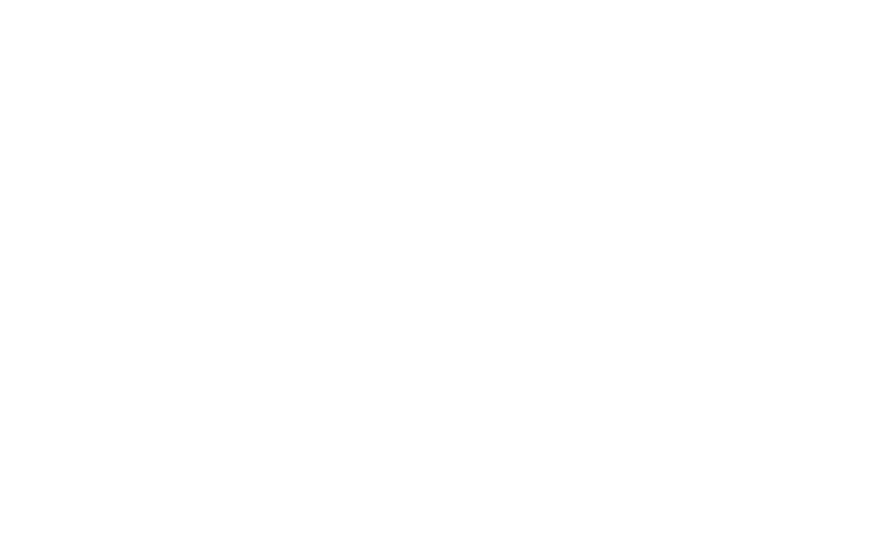

<p align="center">
  
</p>


Theseus is a Machine Learning algorithm coded using the Keras algorithm to perform Chess moves per given position.

<p align="center">
  
  
  
  
</p>

## Dependencies
Dependencies for Theseus are managed using the Anaconda environments. To install Conda on your device you can follow this link: <a href="https://www.anaconda.com/download">Conda installation guide</a>.

Executing the following command on the root of the project will automatically generate a Conda environment with all the dependencies needed:
```bash
$ conda env create -f env.yml
```

After that, you can activate this environment using the following command:
```bash
$ conda activate theseus_env
```

To exit this environment you can use the following command:
```bash
(theseus_env) $ conda deactivate
```

If you want to remove this environment from your system you can use the following command:
```bash
$ conda env remove --name theseus_env
```

## Try it out
The following steps will instantiate your own version of Theseus and how to play against it.

### Train it
At <code>[src/theseus/](src/theseus/)</code> you can find an <code>engine.py</code> file that declares the class Bot.

### Play against it
At <code>[src/](src/)</code> you are going to find a <code>demo.py</code> file that can be used to play against your own stored version of Theseus using the following command:
```bash
(theseus_env) $ python3 engine.py
```

## The model
Theseus' model consists of various layers that are setted using the Keras module. For simplicity reasons, the layers definitions are split in three functions for the input, the hidden. and output layers.

Note that at the time of writing this document, these layers could probably change, for that in this file they will not be complete as in the current version. To see the current state of these functions you can navigate to <code>[src/theseus/model/layers.py](src/theseus/model/layers.py)</code>.

The input layers function that take an input that is <code>max_moves</code>. It sets three different inputs that are who moves, the board as an 8 by 8 array, and a possible moves array:
```python
def input_layers(max_moves):
    color_input_layer = K.layers.Input(shape=(1,), dtype='int32')
    board_input_layer = K.layers.Input(shape=(8, 8))
    moves_input_layer = K.layers.Input(shape=(1, max_moves))
    ...
```

This is the final function that compiles the model:
```python
def compile_model(output_layer, color_input_layer, board_input_layer, moves_input_layer,
                  metrics=['accuracy']):
    m = K.models.Model(
        inputs=[color_input_layer, board_input_layer, moves_input_layer],
        outputs=output_layer
    )
    m.compile(loss='categorical_crossentropy', optimizer=K.optimizers.Adam(), metrics=metrics)
    return m
```

## Training sessions
This bot uses a combination of supervised learning and reinforcement learning for its training routines taking into consideration the fact that it must learn from its right guesses while also attempting to make correct predictions over data that works as a sort of puzzle for the bot. The idea is to mimic the learning that humans go through while learning chess, the way that we normally play is with a lot of practice while also consulting puzzles to get some more objectively better ways of playing.

### Reinforcement learning
The training sessions for this model consist of the bot firstly playing a given number of Chess games, beggining with a high level of randomness to the moves it makes and the bot learns from these games. Then the algorithm performs a filter for moves where the bot should not be learning from, for instance: the moves of the losing color, from games where a draw occured, and some other cases. The idea behind this is to optimize the learning routines for the bot while also filtering data that may turn out to be bad.

### Supervised learning
After this collection of data, the model uses the Keras' <code>fit</code> method to learn from this data. To improve the way Theseus plays, another level of complexity must be added by using validation data. Validation data will help on the preocess of learning to get better and more precise predictions using unseen data. The objective is to get Chess positions with its best solution, fortunatelly a small part of all the Chess possibilities have already been solved and can be reached in chess positions with seven or less pieces. In this case the data is obtained from the <a href="https://syzygy-tables.info/">Syzygy tablebase</a>.

## Validation data
In the directory <code>data/</code> you can find a "Syzygy" generator that works at randomly getting Chess positions with seven or less pieces. you can get as many samples as you want using:
```python
random_syzygy(verbose=False, iterations=1400)
```
Note that it will iterate 1400 times and will try to get as many samples as possible, it might get less than that, since the function <code>remove_redundancies()</code> will take care of redundancies in the output. The output consists of both a readable and "non-readable" output. The difference lies in the fact that the "non-readable" can be used to fetch the best moves from the Syzygy tablebase API.

Then the output given by <code>random_syzygy</code> can be sent as parameter to:
```python
X0, X1, X2, Y = get_syzygy_output(fen_codes=[], fen_codes_readable=[],
                      url='http://tablebase.lichess.ovh/standard?fen=',
                      verbose=True)
```
This will make calls to the Syzygy tablebase API. This function will return the position, who moves, the choosable moves and the best move provided by the API. All of this already processed in the form of inputs and ouput for the Theseus model for its validation data.

## Legacy version
At <code>[legacy/](legacy/)</code> you can find an older version of Theseus. It features a prototype version of the actual bot with far less capabilities, unorganized code, far less scalability, etc.

<hr>
This project was made as the final MVP for Holberton School's Machine Learning SPE.
<br>
<br>

